# Extracted Content from Document

## Source: ../LishiYa_A3_Report_Monster.docx

| SOUTHERN CROSS UNIVERSITY |
| ------------------------- |

ASSIGNMENT COVER SHEET

For use with online submission of assignments

Please complete all of the following details and then make this sheet the first page of each file of your assignment – do not send it as a separate document.

| Signed:

"The Little Monster's Emotion Maze" — An Interactive Storybook App Guiding Children's Emotional Management

Design Documentation

By Lishiya

# Concept Paper

## Introduction

Background Information:

Ages 5–8 represent a critical developmental window during which children transition from merely feeling emotions to being able to name and self-regulate them. However, in everyday home and school settings, children often lack accessible emotional vocabulary and opportunities for repeated, practical practice. "The Little Monster’s Emotion Maze" is grounded in narrative therapy’s concept of externalizing emotions and integrates child-friendly mindfulness exercises, transforming abstract emotional experiences into observable, discussable, and actionable objects.

Market Landscape:

While numerous cognitive-education apps currently exist, most focus on rote knowledge drills or basic emotion recognition. Systematic emotional regulation training combined with immersive interactive experiences remains scarce. Parents and schools are rapidly increasing their demand for tools that support emotional and behavioral management—tools that are easy to learn, usable at home, and provide visualized feedback on a child’s progress.

Inspiration and Design Philosophy:

This project translates the concepts of emotion externalization and mindfulness practice into a metaphorical world of mazes and little monsters. Children take on the role of "emotion helpers," navigating mazes to complete a closed-loop process of emotion identification, targeted regulation practice, and reflective reinforcement. Through this engaging, gamified experience, children repeatedly practice and internalize transferable emotional regulation skills.

## Updated sketches and details

1. Text Color Evolution - Changing text to white color

2. Contextual Titles & Narrative Text- Adding emotion-specific titles

3. Home Scene Polish - Audio,visual, and UX enhancements

4. Architecture Simplification- Removing character controller

## Evaluation Form and Feedback

## Link to GitHub and itch.io

Place your GitHub (or OneDrive or Dropbox for example) and/or itch.io links in here if you decide to prototype your designs beyond the documentation. Make sure your GitHub project is public as often the links will not work if the project is set to private.

GitHub: https://github.com/1lishiya1/Monster_Emotion

Itch.io: https://**\*\*\*\***\_**\*\*\*\***

## Module Journals

Module Log 1

Module Description: Helps children quickly articulate their current feelings. After selecting the corresponding emotion, they can proceed to the matching interface, ensuring interactions are better aligned with their emotional state.

Date: 2025-10-10

Version/Build: v1.1

Change Type: User experience and textual description optimization

Change Details: Replaced the original circular buttons with rectangular buttons.

Reasons for Change:

1. Improved Operability: Compared to circular buttons, rectangular buttons offer a more structured and predictable touch area. This significantly reduces the likelihood of accidental taps by children, as precise finger placement is no longer required—enhancing operational stability and ease of use.

2. Enhanced Text Legibility: Buttons must display both emotion icons and associated labels (e.g., “Happy,” “Sad”). Rectangular buttons provide more horizontal space, allowing for larger font sizes and better text layout, which improves clarity and helps children quickly and accurately identify button options, minimizing selection errors.

---

Module Log 2

Date: 2025-10-11

Version/Build: v1.2

Change Type: Added background music

Change Details: Introduced context-appropriate background music for the central hub and each emotion-specific functional interface to enhance overall interactive engagement.

Reasons for Change:

1. Strengthen Emotional Resonance: Music is a powerful medium for conveying emotions. By pairing each emotional scenario with tailored background music, children can more intuitively sense and immerse themselves in the corresponding emotional atmosphere, supporting accurate expression of their current feelings.

2. Increase Immersive Engagement: Adding background music enriches the sensory dimensions of interaction beyond just visual and tactile feedback. This creates a more holistic experience as children select emotions and transition into interfaces, boosting their interest, engagement, and focus while reducing distractions.

3. Align with Children’s Cognitive Traits: Children are highly sensitive to auditory stimuli. Gentle, scene-matched background music fosters a relaxed and enjoyable interaction environment, lowering anxiety during use. It also prevents the cognitive strain that can arise from overly quiet settings, thereby improving overall comfort and usability.

---

Module Log 3

Date: 2025-10-15

Version/Build: v1.3

Change Type: Adjusted font color for better harmony with background colors

Change Details: Modified text color parameters across the central hub and all emotion-specific functional interfaces to achieve better visual contrast with their respective backgrounds, enhancing text readability.

Reasons for Change:

1. Improved Visual Clarity: Children’s visual discrimination abilities are still developing. Insufficient contrast between text and background can cause blurriness and increase recognition difficulty. The updated color scheme ensures higher visual distinction, making labels and instructions more prominent—helping children quickly read button identifiers and guidance text, and reducing hesitation or misselection due to unclear text.

2. Reinforced Emotional Atmosphere: Each emotion-specific interface features a unique visual style. By adapting font colors to complement these backgrounds, the emotional tone of each scene is further emphasized, aligning with the module’s core goal of supporting emotional expression.

3. Reduced Visual Fatigue: Poor color coordination forces children to strain their eyes to read text, leading to visual fatigue. The optimized palette aligns with children’s visual processing preferences, enabling effortless reading without excessive focus—enhancing comfort during extended use and maintaining a smooth, uninterrupted interactive experience.

## Link to Reflective video

[这应包括对项目的自我评估以及完成评估所经历的流程。我们期望你在视频中讨论用户体验原则。你应该使用PowerPoint演示文稿来展示项目截图，以便证明你理解已应用于项目的流程和用户体验原则。你可以将视频上传至YouTube并设为未公开，或通过OneDrive、Dropbox或其他文件共享工具进行分享。必须在视频开头显示你的ID。请注意用胶带遮盖任何个人信息（如地址）。若未遵守此规定，YouTube可能会标记并删除该视频。]

直接放链接

# Updated Functional Specifications

## Updated User Interface

This project features a user interface specifically designed for children aged 5–8, aiming to create an intuitive, immersive, and emotionally expressive interactive experience. The overall visual language is soft and rounded—employing low-contrast shadows, gentle edges, and ample white space—to reduce visual clutter and minimize interaction-related anxiety. Typography prioritizes high readability, and touch targets are generously sized to ensure accuracy for young users’ finger-based navigation.

Color serves as a core narrative tool throughout the interface, dynamically responding to the emotional state of Morro, the little monster, thereby transforming abstract emotional experiences into tangible, perceptible visual cues. Each emotion is mapped to a distinct color palette:

- Anger → _Volcanic Red_: High intensity but non-harsh, conveying energy without visual aggression.

- Sadness → _Soft Gray_: Low saturation to evoke calmness and quiet introspection.

- Fear → _Night Blue_: Accompanied by slightly dimmed background brightness to reflect the subdued, cautious nature of fear.

- Excitement → _Honey Yellow_: High brightness with carefully controlled saturation to express joy without overwhelming the senses.

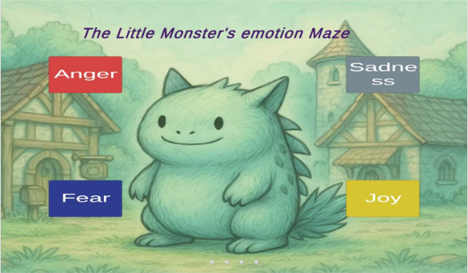

Home Screen:

Anger Screen：

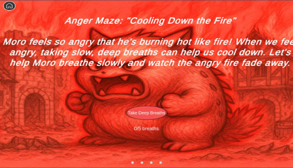

Fear Screen：

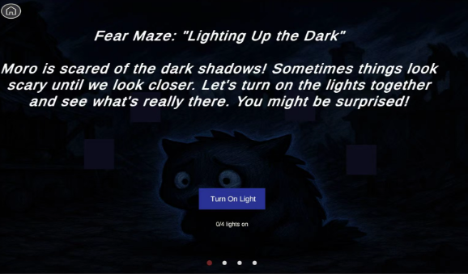

Joy Screen：

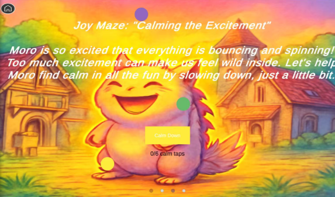

Sadness Screen：

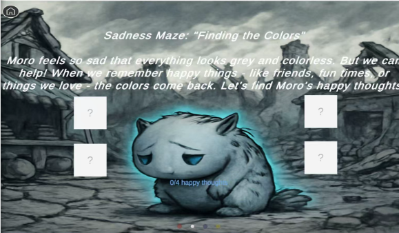

Finish Screen ：

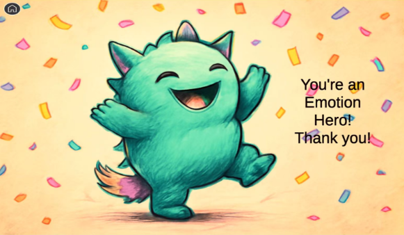

## Updated Storyboards

Title: Home Page Frame ID: Home

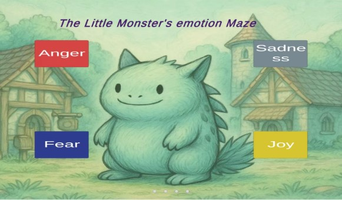

Dimensions:16:9 (e.g., 1920x1080px)

Media Used: none

Buttons:

Anger、Sadness、Fear、Joy。

Background

The background employs a low-saturation, warm-toned green—soft and non-glaring—to create a cozy, storybook-like atmosphere. This gentle backdrop avoids visual competition with the high-saturation emotion buttons, ensuring the interactive elements remain the clear focal point and enabling children to quickly identify actionable areas.

Content Layout

- Moro (Central Character):

  Positioned at the exact center of the screen, Moro serves as the primary visual anchor. Its design features smooth, rounded contours with no sharp edges, conveying safety and friendliness. This allows children to intuitively observe and interpret Moro’s emotional state.

- Emotion Buttons:

  Four solid-color rectangular buttons are arranged around Moro, each representing a core emotion:
  - Anger: Red base + white text — high contrast for strong visual prominence.

  - Sadness: Gray-blue base + white text — color tone aligns with the quiet, introspective nature of sadness.

  - Fear: Deep blue base + white text — darker hue conveys caution and unease.

  - Joy: Bright yellow base + white text — high luminance reflects positive, energetic emotion.

  Tapping any button immediately navigates the child to the corresponding emotion maze interface, enabling direct and immediate interaction.

Description (Purpose & Objectives)

As the product’s main landing page, the core purpose is to empower children aged 4–8 with the ability to independently assess and choose an emotional context. Using Moro as an emotional proxy, children observe its expression and posture, infer its current feeling (anger, sadness, fear, or joy), and then actively select the matching button to enter the relevant emotion maze.

Key Objectives:

1. Foster Autonomy: Children take control of the interaction rather than passively following instructions. For example, if they perceive Moro as angry, they proactively tap the _Anger_ button; if they sense sadness, they choose _Sadness_. This nurtures early logical reasoning and emotional inference skills.

2. Enable Flexible Exploration: Supports both first-time users (who may explore randomly) and returning users (who may target specific emotions), allowing quick, low-friction access to any emotion maze.

3. Bridge Cognitive Understanding: The emotion identification step on the home screen primes children for deeper emotional learning within the mazes, establishing an initial link between visual cues, labels, and internal feelings.

Animations

1. Button Interaction Animation:

   Upon tap, the selected emotion button emits a soft glow, followed by a smooth page transition into the corresponding maze. The animation tempo is calm and unhurried, matching children’s visual processing pace.

2. Page Transition Animation:

   The navigation from home screen to maze interface completes within 0.5 seconds, minimizing wait time and preventing attention drift or frustration.

User Interactions Required

1. Bottom Page Indicator:

   Four small gray dots centered at the bottom indicate the total number of primary emotion options and highlight the current context (e.g., after selection, the dot may briefly pulse or remain neutral—since this is a hub, not a carousel, the indicator primarily signals structural clarity).

2. Core Interaction:

   Tap any of the four Emotion Portal Buttons (Anger / Sadness / Fear / Joy) surrounding Moro to instantly enter the matching emotion maze.

3. Return Interaction:

   From any emotion maze, tapping the Home button returns the child directly to this main screen, enabling easy re-selection or exit at any time.

4. Interaction Accessibility:
   - Emotion buttons: minimum size 40px × 40px

   - Home button: minimum size 30px × 30px

   - All interactive elements are inset by at least 10px from screen edges to accommodate children’s motor control and reduce accidental taps or missed inputs.

User Feedback

1. Auditory Feedback:

   A gentle, positive sound plays the moment a button is tapped—volume calibrated to be engaging without being startling or overwhelming, enhancing playfulness while supporting sensory comfort.

2. Visual-Auditory Synchronization:

   The glow animation, sound effect, and screen transition occur in seamless coordination. This clear cause-and-effect feedback loop helps children confidently associate their action (tap) with the outcome (entering a maze), preventing confusion due to delayed or ambiguous responses.

Navigation / Links:

Tap Anger Portal -> Frame ID: Maze_Anger

Tap Sadness Portal -> Frame ID: Maze_Sadness

Tap Fear Portal -> Frame ID: Maze_Fear

Tap Joy Portal -> Frame ID: Maze_Joy

Title: Anger Maze Frame ID: Maze_Anger

Dimensions:16:9 (e.g., 1920x1080px)

Media Used: Ominous low rumbles + crackling fire sound effects

Buttons:

Primary Button: Oval-shaped, coral-pink button labeled “Take Deep Breaths”

Background

The entire scene is bathed in a unified red color filter, extending from the background to Moze’s body, creating an intense, heated atmosphere that mirrors the physiological experience of anger. All text and key interactive elements use high-contrast white to ensure legibility against the red backdrop. The coral-pink button harmonizes with the red theme while standing out through controlled luminance contrast—making it the clear interactive focal point without causing visual clutter or confusion.

Content

At the center of the screen, the little monster Moze vividly expresses anger:

- Mouth wide open, revealing small teeth, accompanied by audible “huff-huff” breathing sounds

- Furrowed brows with visible wrinkles

- Clenched fists

- Short spikes on its back fully erect

This exaggerated yet age-appropriate expression, combined with the pervasive red tone, leverages color psychology to help children aged 4–8 instantly recognize and label the emotion as _anger_.

Description (Purpose & Objectives)

As the dedicated anger regulation scene, this page uses narrative-driven interaction to help children understand that anger can be managed through deep breathing—and to practice this skill in a guided, playful context.

Key Objectives:

1. Cognitive Framing:

   The title “Cooling Down the Fire” and supporting text metaphorically equate anger with a flame and deep breathing with cooling water. This concrete analogy helps young children grasp the abstract link between emotion and regulation strategy.

2. Behavioral Practice:

   Children are given a clear, achievable task: complete 5 deep breaths. The “Take Deep Breaths” button and the “0/5 breaths” counter guide them through active participation, turning emotional regulation into a tangible, repeatable action.

3. Empathetic Engagement:

   By framing the activity as _helping Moze calm down_, the interface encourages children to shift from passive observers to caring helpers. This fosters emotional awareness, empathy, and a sense of agency in managing both their own and others’ feelings.

Animations

1. Scene Entrance:

   The red background gradually deepens from pale to full intensity, while subtle flame elements fade in from transparency to clarity—visually simulating the _build-up_ of anger.

2. Progress Visualization:

   With each completed breath (button tap):
   - The counter updates (e.g., “1/5”) with a gentle bounce and fade-in

   - Background flames become progressively more transparent

   - Moze’s facial tension eases slightly (eyebrows relax, mouth closes a bit)

   This provides immediate, multi-sensory feedback that anger is decreasing as they practice.

3. Navigation Exit:

   Tapping the Home button (top-left) triggers a 0.5-second exit animation, ensuring smooth and predictable return to the main hub.

User Interactions Required

1. Tap “Take Deep Breaths” Button:
   - Each tap counts as one deep breath

   - Five taps are required to complete the calming sequence

   - Button meets child-friendly sizing and spacing standards to minimize mis-taps

2. Monitor Progress:
   - The “0/5 breaths” display below the button shows real-time progress

   - No additional input needed—information is passively visible, aligning with low-cognitive-load design for young users

User Feedback

1. Button Interaction Feedback:
   - On touch: button scales up slightly and darkens in color

   - On release: button briefly indents and emits a soft expanding breath ripple animation

   → This layered visual response confirms the system has registered the input

2. Progress & Emotional Feedback:
   - Counter numbers animate with a subtle pop and fade

   - Flames dim incrementally with each breath

   - Moze’s expression softens progressively (e.g., fists unclench, spikes lower)

   → Together, these changes create a cohesive, emotionally resonant narrative: _“My actions are helping Moze—and myself—feel calmer.”_

Navigation / Links:

After core is calmed, auto-navigates to Frame ID: Credits.

Title: Fear Maze Frame ID: Maze_Fear

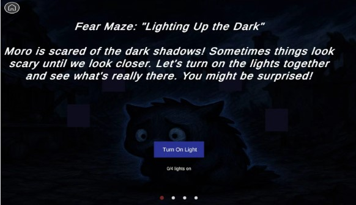

Dimensions:16:9 (e.g., 1920x1080px)

Media Used: Eerie wind sound effects (SFX) + subtle, rhythmic heartbeat pulses

Buttons: Deep blue, slightly rounded rectangle labeled “Turn On Light”

Background

A deep, dark backdrop evokes the atmosphere of a shadowy forest or cave, immersing the child in a setting that mirrors the feeling of fear. The deep blue action button stands out clearly against the dark background without using high-saturation colors that could overstimulate or heighten anxiety.

- Text elements appear in pure white for maximum legibility.

- Unlit lamp indicators use near-black tones, creating a stark yet gentle contrast that aligns with children’s developing visual perception—ensuring interactive elements are identifiable without causing visual strain.

Content

At the center sits Moro, a small, round-bodied monster trembling slightly with fear. Its large eyes are wide with alarm, scanning the darkness. Its skin glows faintly lavender, making it appear vulnerable and alone in the gloom.

The surrounding environment—a dim cave or dense forest—is shrouded in darkness, punctuated only by occasional unsettling sounds (wind gusts, distant rustles). Moro hugs itself tightly, embodying the instinctive response to fear.

Through interaction, the child can click the “Turn On Light” button to gradually illuminate the scene:

- Each click activates one soft, warm light around Moro

- With every light, the scene brightens, shadows recede, and Moro’s form becomes clearer and calmer

- After four lights are lit, the full environment is revealed—showing harmless, even friendly details hidden in the dark (e.g., glowing mushrooms, a sleeping owl, or a cozy nook), reframing fear as curiosity

Description (Purpose & Objectives)

As the core fear regulation scene, this page uses narrative immersion and incremental interaction to help children aged 4–8 reframe fear of the dark as an opportunity for brave exploration—teaching that action reduces fear.

Key Objectives:

1. Cognitive Reframing:

   The title “Lighting Up the Dark” and supporting text present darkness not as a threat, but as something that can be gently explored through light. This helps children associate agency (turning on lights) with emotional relief.

2. Guided Behavioral Practice:

   The clear goal—light 4 lamps—is tracked via a “0/4 lights on” counter. Each tap on the button progresses the child toward safety, allowing them to physically experience the shift from fear to reassurance.

3. Empathetic Engagement:

   By helping Moro overcome its fear, children step into a caring, proactive role. This fosters emotional awareness and builds confidence in their own ability to manage fear.

4. Narrative Continuity:

   This page serves as the emotional and interactive core of the Fear Maze, setting up the payoff: once all lights are on, the “scary” dark reveals itself to be full of gentle, non-threatening details—teaching that fear often distorts reality.

Animations

1. Scene Entrance:

   The background transitions from dark gray to deep black, while environmental details (trees, rocks, cave walls) fade in from full transparency to faint visibility—mimicking the sensation of stepping into an unfamiliar, shadowy space.

2. Lamp Lighting Animation:
   - Each click on the “Turn On Light” button (or directly on a lamp tile) triggers one lamp to glow softly

   - The entire scene brightens by 15–20% per lamp

   - Moro’s silhouette gains definition, and its trembling slows

   - Background elements (e.g., leaves, stones) gradually become visible

3. Progress Counter Animation:

   The “0/4 lights on” display updates with a gentle bounce + fade-in, and the number color shifts from gray to warm white as progress increases.

User Interactions Required

1. Tap “Turn On Light” Button:
   - Each tap lights one lamp (total of 4 required)

   - Button is rounded-rectangle, sized for child-friendly touch accuracy

   - Visual and auditory feedback confirms each action

2. Tap Home Button:
   - Circular Home button in top-left corner

   - Allows instant return to the main hub at any time

   - Positioned within safe touch zone (≥10px from edge)

User Feedback

1. Interactive Element Feedback:
   - Button touch: Slight scale-up + soft inner glow

   - Button release: Subtle press-down effect + outward light ripple

   - Lamp tile touch: Immediate transition from dark to glowing, accompanied by a gentle halo pulse

2. Progress & Emotional Feedback:
   - Counter updates with animated number pop and color shift

   - Scene brightness increases incrementally

   - Moro’s form becomes clearer, trembling decreases

   - Hidden background details emerge, transforming the environment from “scary” to “safe”

3. Auditory Feedback:
   - Each lamp activation plays a soft, reassuring “click-whoosh” sound (0.3 seconds)

   - Volume is low and warm—never startling—reinforcing the idea of gentle control over fear

Navigation / Links:

After illuminating the central "monster" shadow, auto-navigates to Frame ID: Credits.

Title: Joy Maze Frame ID: Maze_Joy

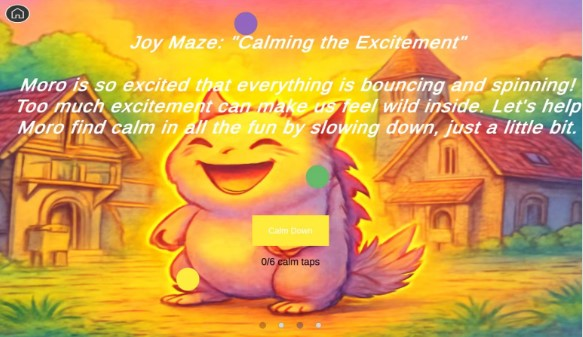

Dimensions:16:9 (e.g., 1920x1080px)

Media Used: Gentle chimes, soft bubbling sounds, and light ambient sparkle effects

Buttons: Soft yellow “Calm Down” button (rounded rectangle), serving as the main interactive control

Background

A warm golden-orange backdrop radiates cheerful energy, evoking the feeling of sunshine and celebration. The main “Calm Down” button uses a softer, lighter yellow—bright enough to stand out, yet low in saturation to prevent visual fatigue during repeated interaction.

Scattered across the scene are “calm points”—small interactive circles in muted purple, green, and yellow—adding visual variety without competing with the primary button.

- Text elements appear in pure white for high contrast and readability

- Home button uses dark gray against the warm background, ensuring clear visibility

- All color choices align with children’s visual development, balancing engagement with perceptual comfort

---

Content

At the center, Moro beams with pure joy:

- Mouth wide open in a hearty laugh

- Cheeks plump and lifted

- Eyes curled into cheerful crescents, with tiny “joy wrinkles” at the corners

- His entire body glows with a soft, pulsing yellow aura, radiating warmth

Around him, the environment subtly bounces and shimmers—leaves flutter, sparkles float, and small objects jiggle—visually representing over-excitement. Nearby, a brief white text bubble explains _why_ Moro is so happy (e.g., “I just found a rainbow treasure!”), grounding the emotion in a relatable narrative.

The child’s role? Help Moro gently settle from wild excitement into calm joy.

---

Description (Purpose & Objectives)

As the core joy regulation scene, this page teaches children aged 4–8 that even positive emotions like excitement can feel overwhelming—and that slowing down is a kind, helpful choice.

Key Objectives:

1. Cognitive Awareness:

   The title “Calming the Excitement” and supporting text reframe overstimulation not as “bad,” but as a natural state that can be gently balanced. Children learn that joy is wonderful—and even better when shared calmly.

2. Regulation Practice:

   The task—complete 6 calm taps—is tracked via a “0/6 calm taps” counter. Children can either tap the “Calm Down” button or directly interact with the floating calm points. This slow, rhythmic interaction mirrors deep breathing or mindful pausing, helping them physically experience emotional grounding.

3. Empathetic Engagement:

   By seeing Moro’s joyful but slightly chaotic energy (glowing intensely, surroundings bouncing), children recognize that even happy feelings can need balance. Helping Moro “settle” fosters emotional intelligence and self-regulation through care for another.

---

Animations

1. Element Entrance (0.6 sec):
   - Three calm-point circles bounce gently into the scene from different directions

   - The “Calm Down” button slides up smoothly from the bottom

   → Prevents visual overload and supports focused attention

2. Click Response (0.5 sec):
   - Tapping a calm point triggers a gentle easing animation: the circle pulses inward, then releases a soft ripple

   - Moro’s glow dims slightly with each tap

3. Progress Counter Update:
   - The “0/6 calm taps” number fades in upward with a subtle color shift (e.g., gray → warm white)

   - Reinforces a sense of accomplishment and forward motion

4. Page Exit:
   - Tapping Home triggers a 0.5-second fade-out, returning the child to the main hub with clear navigation logic

---

User Interactions Required

1. Tap Home Button:
   - Circular button in top-left corner

   - Allows instant exit at any time

   - Positioned ≥10px from screen edge for reliable touch access

2. Tap “Calm Down” Button or Calm Points:
   - Two interaction paths offer flexibility:
     - Tap the main yellow button (size ≥ 60px × 24px)

     - Or tap any of the floating calm-point circles

   - Each tap counts toward the 6-tap goal

   - Ample spacing (≥15px) minimizes accidental inputs

---

User Feedback

- Progress & Emotional Feedback:
  - Counter numbers animate with a soft fade-in + upward lift and warm color transition

  - Scene dynamics slow down: bouncing objects settle, sparkles fade

  - Moro’s glow gradually softens, and his smile becomes serene (less wide, more relaxed)

  - Background warmth remains, but intensity decreases, reflecting balanced joy

Navigation / Links:

After all orbs are harmonized, auto-navigates to Frame ID: Credits.

Title: Sadness Maze Frame ID:Maze_Sadness

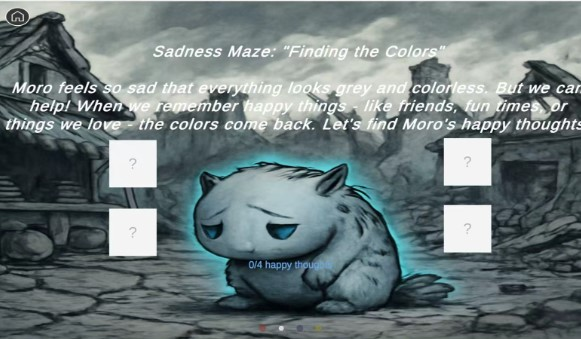

Dimensions:16:9 (e.g., 1920x1080px)

Media Used: Soft ambient background (e.g., gentle rain, distant piano notes); subtle emotional sound design

Buttons: Interactive Elements: Four white “?” cards (serving as clickable memory prompts)

Background

The scene is set against a deep gray-cyan background, evoking the quiet heaviness of sadness—like the stillness before a storm. Despite the muted palette, Moro emits a soft cyan-blue glow, symbolizing a quiet but enduring spark of hope.

- The white “?” cards stand out clearly against the grayscale environment, ensuring immediate visual recognition as interactive elements.

- Instructional and title text appears in pure white for maximum legibility.

- The progress indicator (“0/4 happy thoughts”) uses the same cyan-blue as Moro’s glow, creating a visual thread between emotional progress and the character’s inner light.

- The Home button is rendered in dark gray, maintaining visibility without disrupting the contemplative mood.

All visual choices align with children’s perceptual development—prioritizing contrast, emotional clarity, and gentle engagement over stimulation.

---

Content

At the center, Moro embodies deep sorrow:

- Head bowed, eyes downcast

- Long lashes glistening with unshed tears

- Body curled inward slightly, shoulders trembling with quiet, suppressed sobs

- The world around him appears drained of color, rendered in cool grays and desaturated blues

Nearby, four white “?” cards hover like unanswered questions—each concealing a happy memory (e.g., “My friend shared their snack with me,” “I saw a rainbow after the rain”). A soft white caption explains _why_ Moro is sad (e.g., “My pet snail went missing”), grounding the emotion in a relatable, age-appropriate narrative.

As the child taps each card, color gently returns to the scene—first in small bursts, then spreading—visually representing how joyful memories can soften sadness.

---

Description (Purpose & Objectives)

As the core sadness regulation scene, this page helps children aged 4–8 understand that sadness is natural—and that recalling positive experiences can bring comfort and light.

Key Objectives:

1. Cognitive Reframing:

   The title “Finding the Colors” and supporting text frame sadness as a “colorless world” that can be re-illuminated through happy thoughts. This metaphor helps children intuitively grasp how memory and perspective can shift emotional states.

2. Active Emotional Regulation:

   The clear goal—reveal 4 happy thoughts—is tracked via the “0/4 happy thoughts” counter. Each tap uncovers a joyful memory and triggers a gradual return of color and light to the environment, allowing children to _visually witness_ their positive impact on Moro’s emotional state.

3. Empathetic Engagement:

   Moro’s vulnerable posture and faint glow invite care and connection. By helping him “find the colors,” children step into the role of a compassionate helper, building emotional awareness and reinforcing that they can actively soothe both others’ and their own sadness.

---

Animations

1. Card Reveal (0.6 seconds):
   - Tapping a “?” card triggers a smooth 3D flip animation

   - During the flip, the gray question mark fades away

   - The reverse side reveals a vivid, colorful illustration of a happy memory

   - The card then settles back to its original size, now permanently colored

   - Simultaneously, the entire scene gains 15–20% in saturation and brightness, as if warmth and light are returning to the world

2. Progress Counter Update:
   - After each reveal, the “0/4 happy thoughts” number fades in with an upward motion and transitions from gray to cyan-blue, reinforcing emotional progress

3. Page Exit:
   - Tapping the Home button initiates a 0.5-second fade-out transition, ensuring clear and predictable navigation back to the main hub

---

User Interactions Required

1. View Progress:
   - The “0/4 happy thoughts” text is displayed prominently in front of Moro

   - No interaction needed—progress is passively visible, supporting low cognitive load and accessibility

2. Tap Home Button:
   - Circular button located in the top-left corner

   - Enables instant return to the main page at any time

   - Positioned ≥10px from screen edges to ensure reliable touch access for small hands

---

User Feedback

1. Emotional & Visual Progress Feedback:
   - Counter numbers animate with a gentle fade-in + upward lift and shift to cyan-blue as progress increases

   - Scene saturation and brightness rise incrementally with each happy memory revealed

   - Moro slowly lifts his head, uncurls his posture, and his cyan glow brightens and expands

   - By the fourth memory, warm tones subtly return to the background—sadness remains valid, but is now softened by hope and connection

2. Navigation Audio Feedback:
   - Tapping Home plays a soft, 0.3-second exit chime at 40 dB—calm and unobtrusive, preserving the reflective emotional tone while confirming the navigation action

Navigation / Links:After all objects are colored, auto-navigates to Frame ID: Credits.

Title: Credits Page Frame ID:Credits

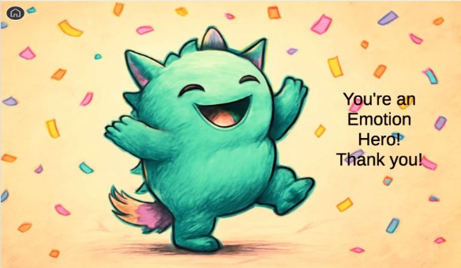

Dimensions:16:9 (e.g., 1920x1080px)

Media Used: none

Buttons: none

Background

A warm peach-beige backdrop creates a cozy, uplifting atmosphere—like sunlight after a gentle rain. This neutral, nurturing base allows vibrant celebratory elements to shine without overwhelming the child.

- Moro is rendered in fresh mint green, with a gradient tail that adds playful energy and visual dynamism.

- Confetti elements in high-saturation orange and golden yellow float through the air, creating festive contrast against the soft background and reinforcing a sense of joyful accomplishment.

- Text appears in pure black for maximum legibility.

- The Home icon uses dark gray, ensuring clear visibility while maintaining visual harmony.

All design choices support children’s visual processing—balancing warmth, clarity, and celebration without sensory overload.

---

Content

Moro radiates pure joy:

- Eyes wide and sparkling with excitement

- Mouth stretched into a broad, beaming smile

- Tail wagging energetically from side to side

This elation is earned: Moro has just completed the full Emotion Maze, successfully navigating anger, fear, sadness, and joy with the child’s help. Nearby, black text explains in simple, vivid language: _“You helped me calm my anger, face my fears, find happy thoughts in sadness, and enjoy joy without getting too wild! We did it together!”_

The scene is filled with floating golden confetti and soft sparkles—visual rewards for persistence and emotional courage.

---

Description (Purpose & Objectives)

As the final celebration page of the Emotion Maze journey, this screen delivers ritualized positive reinforcement to children aged 4–8, closing the experience with warmth, pride, and clarity.

Key Objectives:

1. Reinforce Achievement:

   The “Emotion Hero!” headline, Moro’s exuberant pose, and animated confetti create a tangible sense of success, boosting the child’s self-esteem and confidence in their emotional skills.

2. Emotional Closure:

   After potentially intense emotional scenarios (anger, fear, sadness), this warm, uplifting finale provides psychological resolution—ensuring the child ends the experience feeling capable, safe, and happy.

3. Clear Next Step:

   The Home icon offers a simple, intuitive path back to the main hub, enabling replay, sharing, or exploration—without overwhelming the child with choices.

4. Cognitive Anchoring:

   By linking celebration to active emotional problem-solving, the scene subtly reinforces that emotions can be understood and managed—laying groundwork for real-world emotional resilience.

---

Animations

- Home Button Feedback (0.2 sec):
  - On touch: icon scales down slightly and darkens in color

  - Provides immediate visual confirmation of input

- Page Exit Transition (0.5 sec):
  - Upon release, the celebration screen slides left out of view

  - The main hub slides in from the right, creating a smooth, directional navigation flow

---

User Interactions Required

1. Tap Home Icon:
   - Circular icon in top-left corner

   - Returns child to the main page

   - Positioned ≥10px from screen edge for reliable touch access

2. Error Tolerance:
   - Taps outside the Home icon produce no visual or auditory feedback, preventing confusion or accidental actions

---

User Feedback

- Visual Confirmation Only:
  - The Home icon’s color deepening and subtle scaling clearly signals that the tap has been registered

  - No sound is used during interaction to preserve the calm, reflective joy of the moment—consistent with the scene’s gentle celebration tone

Navigation / Links:

Tap Home Button -> Frame ID: Home

Tap Replay Button -> Re-enters the last completed maze.

## Final Media List

| Image name or description | Resource address/URL                                                  |
| ------------------------- | --------------------------------------------------------------------- |
| all media                 | https://github.com/1lishiya1/Monster_Emotion/tree/main/Assets/Sprites |

# References

Text in this section is not included in maximum word count.

# Appendix A

Include screen shots – essential if evaluating an application and other information here

# Appendix B – GenAI use

## Acknowledgement Statement:

I acknowledge that I have used GenAI to complete this assessment. I used <GenAI tool(s)> to <specific purpose(s) of using GenAI> within the parameters outlined in the Assessment Brief and by the Unit Assessor. I have maintained accurate records of my GenAI use where applicable and acknowledge that I may be required to provide further evidence.

## GenAI generation conversation:

<paste your conversation with your GenAI tool here.>
